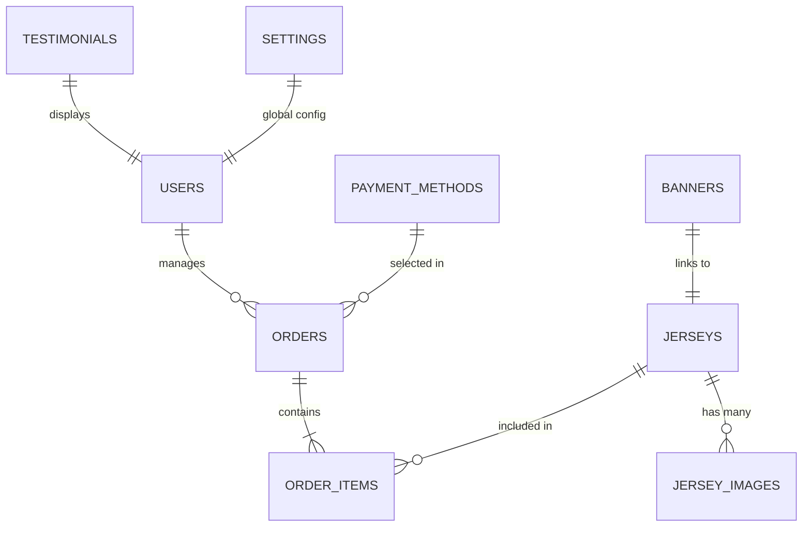
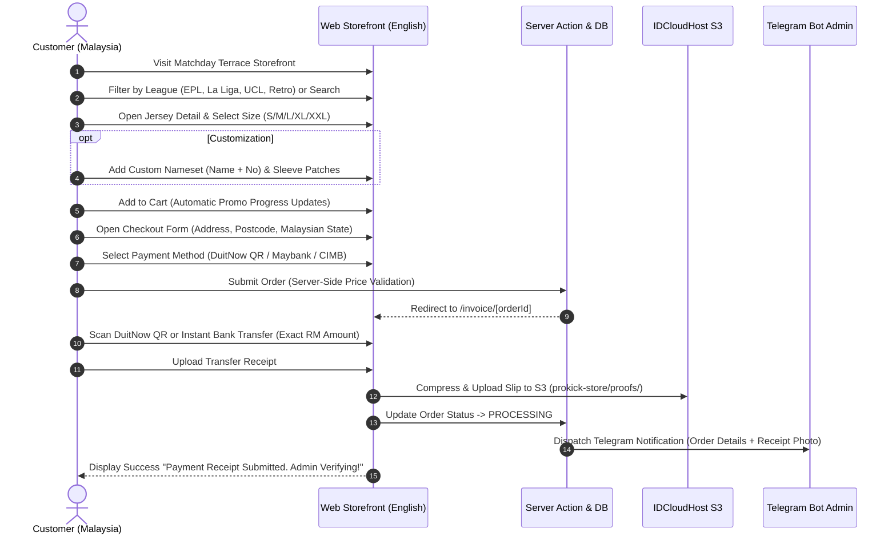
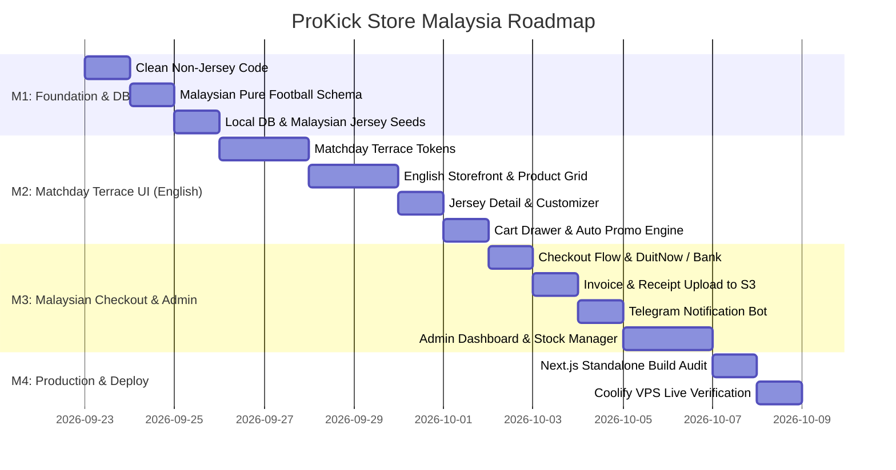

# 📋 PRODUCT REQUIREMENTS DOCUMENT (PRD)
# PROKICK STORE — THE ULTIMATE FOOTBALL JERSEY DESTINATION (MALAYSIA)

> **Project Status**: 🚀 INITIATION & REVAMP FROM ZERO  
> **Document Version**: `3.1.0 (Malaysia Edition — English UI & MYR)`  
> **Release Date**: 22 September 2026  
> **Target Market**: Football Fans, Jersey Collectors, Club & National Team Supporters in Malaysia  
> **Language & Currency**: **English UI / Copy** with **Malaysian Ringgit (MYR / RM)** currency  

---

## 1. Executive Summary & Product Vision

### 1.1 Vision
Build **ProKick Store** as the premier football jersey e-commerce destination in Malaysia with a world-class visual experience. Adopting the **matchday terrace** design language defined in [`DESIGN.md`](../DESIGN.md) (Dark Mode First), responsive across all devices, featuring an all-English user interface, Malaysian Ringgit (RM) pricing, and a frictionless self-checkout flow from size selection and custom nameset/patch options to instant DuitNow QR and bank transfer proof verification.

### 1.2 Core Revamp Pillars (Pure Football Edition)
1. **100% Pure Football Jersey Specialization**:
   - Zero non-jersey clutter (shoes, windbreakers, accessories removed from schema and code).
   - Pure football catalog: **Top European Clubs (Premier League, La Liga, Serie A, Champions League)**, **National Teams (World Cup, Euro, Harimau Malaya / Asian Cup)**, **Retro / Vintage Classics**, **Kids / Youth Kits**, and **Player Issue vs Fan Version**.
2. **Matchday Terrace Design (Dark Mode First)**:
   - Papan skor & dinding ruang ganti: canvas `#09090B`, kartu `#121217`, radius `12px`, aksen tunggal volt `#E2F952`. Palet, tipografi, radius, dan aturan keras: **`DESIGN.md` adalah sumbernya** (PRD ini hanya ikut).
   - Rich visual presentation: jersey previews, live size availability tags, special edition badges, and fabric/patch detail closeups.
   - 100% English UI text, banners, buttons, and system messages.
3. **Self-Service Malaysian Web Checkout & Smart Promos**:
   - Interactive slide-over cart (*promo drawer*) with automated tiered bundle promos (Buy 2 Free Shipping, Buy 3 Free Patch, Buy 5 Free Nameset + 1 Bonus Jersey).
   - Native web checkout supporting Malaysian logistics (Peninsular Malaysia & Sabah / Sarawak) and payment options: **DuitNow QR** and **Instant Bank Transfer** (Maybank, CIMB Bank, Touch 'n Go eWallet).
   - Customers upload payment receipt directly on the Invoice page `/invoice/[orderId]`.
   - Real-time notification dispatcher sends order summary and receipt photo to the **Telegram Bot Admin**.
   - Admin verifies payment (*PENDING* ➔ *PROCESSING* ➔ *SHIPPED* ➔ *COMPLETED*) and provides courier tracking numbers (Pos Laju, J&T Express MY, Ninja Van MY).

---

## 2. Tech Stack & System Architecture

| Layer | Technology | Specifications & Rationale |
| :--- | :--- | :--- |
| **Framework** | **Next.js 16 (App Router)** | React Server Components (RSC) for instant SEO, Server Actions for secure mutations, React 19. |
| **Language** | **TypeScript** | `strict: true`, end-to-end type safety from PostgreSQL schema to UI components. |
| **Styling & Design System** | **Tailwind CSS v4 + Shadcn UI** | Design tokens mengikuti `DESIGN.md`, dark-mode CSS variables, micro-animations. |
| **Icons & Motion** | **Lucide Icons + Framer Motion** | Clean 24px sports iconography, motion level 1 (hover/fade saja). |
| **Database** | **PostgreSQL (Coolify VPS / Dev)** | Rock-solid relational database for orders, stock consistency, and transaction integrity. |
| **ORM & Migrations** | **Drizzle ORM** | Lightweight, type-safe query builder with instant schema migrations. |
| **Object Storage** | **IDCloudHost S3 (is3.cloudhost.id)** | Bucket `prokick-store` for high-res jersey images, thumbnails, banners, and payment slips. |
| **Client Compression** | **HTML5 Canvas Compressor** | Browser-side receipt & photo compression (max 1920px, WebP/JPEG 0.82 quality) saving 80% bandwidth. |
| **Admin Notifications** | **Telegram Bot API (HTML Mode)** | Instant push notification of new orders and receipt photos directly to the admin smartphone. |
| **Deployment & Hosting** | **Coolify VPS (Docker Engine)** | Self-hosted production on Ubuntu VPS (`103.193.178.112`). |

---

## 3. Design System & Visual Guidelines

**`DESIGN.md` is the sole visual source of truth.** This PRD does not redefine its palette, typography, radii, motion, or layout rules. Keep the product catalog grid consistent; do not use Bento Grid as the site's visual identity.

### 3.1 Storefront Content
* Currency: Malaysian Ringgit, formatted `RM XX.XX` (e.g. `RM 89.00`).
* Language tone: Bold, athletic, modern English (e.g., "Add to Cart", "Select Size", "Custom Nameset", "Instant DuitNow Checkout").

---

## 4. Database Schema Architecture (Pure Football & Malaysian Localization)

Single-domain schema focused entirely on football jerseys, Malaysian shipping zones, and local payment methods.

### 4.1 Table Definitions (`db/schema.ts`)

1. **`users`**: Admin account (Email, Bcrypt Password Hash, Role `ADMIN`).
2. **`jerseys`**:
   - `id`: UUID (Primary Key).
   - `name`: Full jersey name (e.g. *"Real Madrid Home 2026/27 Player Issue"*, *"Harimau Malaya Special Edition"*).
   - `team`: Club or National Team (e.g. *"Arsenal"*, *"Real Madrid"*, *"Malaysia"*).
   - `league`: League / Tournament (*"Premier League"*, *"La Liga"*, *"Serie A"*, *"World Cup"*, *"Retro Classic"*).
   - `season`: Season string (*"2026/2027"*, *"1998/1999"*).
   - `type`: Jersey edition (*"Player Issue"*, *"Fans Version"*, *"Retro"*, *"Kids"*).
   - `price`: Numeric (Base price in MYR, e.g. `89.00`).
   - `description`: Detailed specifications (fabric tech, ventilation, crest type).
   - `image`: Primary S3 image URL.
   - `sizes`: JSON array of available sizes (`["S", "M", "L", "XL", "XXL"]`).
   - `stockData`: JSON object of stock per size (`{"S": 5, "M": 12, "L": 8, "XL": 2}`).
   - `stock`: Total aggregated inventory count.
   - `tags`: Search tags (*"home, jersey, vintage, ucl, epl"*).
   - `isBestSeller`: Boolean spotlight highlight.
   - `isFeatured`: Boolean carousel display.
   - `createdAt`, `updatedAt`: Timestamps.
3. **`jersey_images`**: Multi-angle gallery per jersey (Front, Back, Crest/Patch detail, Fabric close-up).
4. **`orders`**:
   - `id`: UUID (Primary Key).
   - `orderNumber`: Customer-friendly unique identifier (e.g. `PK-20260922-8491`).
   - `customerName`: Recipient full name.
   - `customerPhone`: Active WhatsApp contact number (Malaysian format `+60` supported).
   - `customerAddress`: Full shipping address including City, State, and Postcode.
   - `shippingZone`: Malaysian shipping zone (*"Peninsular Malaysia"* or *"Sabah & Sarawak"*).
   - `shippingCost`: Numeric (e.g. RM 8.00 Peninsular, RM 15.00 Sabah & Sarawak; RM 0 when bundle promo applies).
   - `subtotal`: Total product price in MYR.
   - `totalAmount`: Grand total (Items + Customization + Shipping) in MYR.
   - `paymentMethodId`: FK to `payment_methods`.
   - `paymentProofUrl`: S3 URL of the uploaded transfer receipt.
   - `paymentStatus`: Enum (*PENDING*, *PAID*, *FAILED*).
   - `orderStatus`: Enum (*PENDING_PAYMENT*, *PROCESSING*, *SHIPPED*, *COMPLETED*, *CANCELLED*).
   - `trackingNumber`: Malaysian courier tracking code (Pos Laju, J&T Express MY, Ninja Van MY).
   - `adminNotes`: Internal admin notes.
   - `createdAt`, `updatedAt`: Timestamps.
5. **`order_items`**:
   - `id`: UUID.
   - `orderId`: FK to `orders`.
   - `jerseyId`: FK to `jerseys`.
   - `size`: Selected size (*S/M/L/XL/XXL*).
   - `quantity`: Quantity ordered.
   - `unitPrice`: Unit price in MYR at order time.
   - `namesetName`: Custom player name on back (optional).
   - `namesetNumber`: Custom squad number (optional).
   - `namesetPrice`: Nameset fee (RM 20.00 / RM 0 via promo).
   - `patch`: Competition sleeve patch (e.g. *"UCL Starball + Foundation"*, *"Premier League Golden"*).
   - `patchPrice`: Patch fee (RM 10.00 / RM 0 via promo).
6. **`payment_methods`**:
   - `id`: UUID.
   - `type`: *"duitnow_qr"* or *"bank_transfer"*.
   - `label`: *"DuitNow QR"*, *"Maybank"*, *"CIMB Bank"*, *"Touch 'n Go eWallet"*.
   - `accountName`: Account holder name (e.g. *"PROKICK STORE"*).
   - `accountNumber`: Bank account number or DuitNow ID.
   - `qrImageUrl`: URL of the DuitNow QR code image on S3.
   - `isActive`: Boolean toggle.
7. **`settings`**:
   - Key-value store: `whatsappNumber`, `telegramBotToken`, `telegramChatId`, `runningBannerText`, `storeAddress`.
8. **`banners`**:
   - Hero promotion banners (S3 Image, Title, Subtitle, CTA Link, Active status).
9. **`testimonials`**:
   - Customer reviews and verified purchase photos.

---

## 5. User Experience & Shopping Flow (English UI)

### 5.1 Customer Journey (From Browse to Payment)

### 5.2 Administrator Operations
1. **Admin Authentication**: Secure login at `/login` with encrypted session cookies and brute-force rate limiting.
2. **Jersey Inventory Management**:
   - Add/edit jerseys with multi-angle image uploads (automatic client-side WebP compression).
   - Live per-size stock control (`S: 10, M: 5, L: 8`).
   - Quick one-click stock increment/decrement directly on the table.
3. **Order Verification & Tracking**:
   - Orders with uploaded payment receipts appear under the *PROCESSING* tab.
   - Admin inspects the high-resolution receipt modal, clicks **Confirm Payment (PAID)**.
   - When dispatched, admin inputs the Malaysian courier tracking number (Pos Laju / J&T Express MY) and sets status to **SHIPPED**.
4. **Payment Methods & Settings**:
   - Manage DuitNow QR images and Malaysian bank account details dynamically without code modifications.
   - Configure WhatsApp support contact and Telegram bot keys directly from dashboard.

---

## 6. Smart Bundle & Promo Engine (Malaysian Market)

To maximize Average Order Value (AOV), ProKick Store includes automated tiered promos:

| Number of Jerseys in Cart | Automatic Bundle Benefits | Customer Savings |
| :---: | :--- | :--- |
| **1 Jersey** | Standard Item Price + Flat Shipping (RM 8 WM / RM 15 EM) | - |
| **≥ 2 Jerseys** | **FREE Shipping Nationwide** (Peninsular & East Malaysia) | Save up to **RM 15.00** |
| **≥ 3 Jerseys** | FREE Shipping + **FREE Sleeve Patch** (UCL or League) | Save up to **RM 25.00** |
| **≥ 5 Jerseys** | FREE Shipping + FREE Patch + **FREE Custom Nameset** + **1 BONUS JERSEY FREE** (Buy 5 Get 6) | Collector's Best Value |

---

## 7. Step-by-Step Implementation Roadmap

* **Milestone 1: Clean Foundation & Single Football Schema**
  - Purge all references to shoes, windbreakers, and non-jersey modules.
  - Implement updated `db/schema.ts` localized for Malaysia (shipping zones, DuitNow/Bank types, MYR currency).
  - Seed popular kits (EPL, La Liga, Serie A, Harimau Malaya / Asian Cup, 90s Retro).
* **Milestone 2: Matchday Terrace UI (English Language)**
  - Apply design tokens from `DESIGN.md` (canvas `#09090B`, volt `#E2F952` accent).
  - Build all-English storefront: homepage spotlight, league filters, jersey cards with RM prices.
  - Interactive product customizer (Sleeve Patch selection + Nameset customization).
  - Promo drawer with live promo tier progress indicator.
* **Milestone 3: Malaysian Self-Checkout & Admin Pipeline**
  - Streamlined English checkout form with Malaysian states and postcode validation.
  - Invoice page `/invoice/[orderId]` featuring DuitNow QR barcode and bank transfer details.
  - Client-side receipt compression and direct upload to S3.
  - Asynchronous Telegram Admin Notification Dispatcher.
  - Admin management panel for inventory, order processing, and courier tracking updates.
* **Milestone 4: Deployment & Live Production Test**
  - Verification with `npm run build` (0 type errors, 0 lint warnings).
  - Production deployment to Coolify VPS with SSL and live smoke testing.

---

## 8. Quality Standards & Acceptance Criteria

1. **Language & Currency Consistency**:
   - 100% of user-facing UI copy is in clean, idiomatic English.
   - All monetary values are rendered in Malaysian Ringgit (`RM XX.XX`).
2. **Performance & Speed**:
   - Google Lighthouse Performance score ≥ 90 on both mobile and desktop.
3. **Security & Anti-Tampering**:
   - Server-side price validation prevents client-side price tampering.
   - Per-size stock is decremented atomically upon order creation.
4. **Reliability**:
   - Payment slips compressed and uploaded reliably to S3.
   - Telegram notification delivered to admin within 3 seconds of receipt upload.
